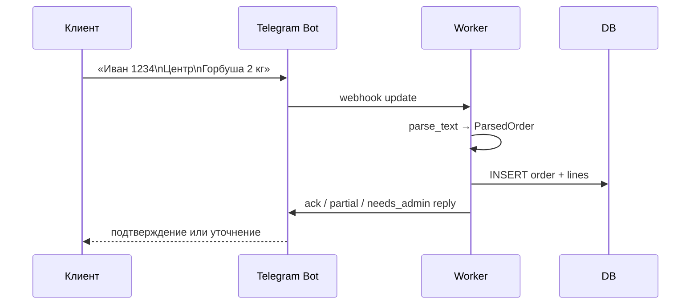

# Пользовательские потоки по ролям

> [!info] Назначение
> Один документ, в котором каждая роль видит свой happy-path и где у неё границы. Используй этот файл, когда добавляешь новый раздел/кнопку — чтобы не сломать чужой scope.

## Роли

| Код | Роль | Где живёт UI |
|---|---|---|
| `owner` | Владелец проекта | Полный admin-web + sysadmin tools |
| `sysadmin` | Системный админ (тех. персонал) | DebugPage, sysadmin toggles |
| `regional_admin` | Региональный админ | OrdersPage, ExportPage по своему региону |
| `pickup_admin` | Админ точки выдачи | OrdersPage с pickup-scope, Delivery UI |
| `customer` | Клиент | Только Telegram-бот |

## 1. Customer (через бота)



**Ключевые ветки:**

- `partial` — товара нет в каталоге → строка остаётся в `unknown_item`, заказ принят частично.
- `needs_admin` — критичная ошибка / распарсилось пусто → отправляется в очередь админа.
- Дозаказ — `/add_to_order Филе минтая 1 кг` (см. `BOT_UI_DEFAULTS.add_to_order_prompt_message`).

См. [[19-bot-architecture]] и [[06-telegram-integration]].

## 2. Pickup admin (точка выдачи)

Сценарий рабочего дня:

1. Открывает [[12-admin-panel#orders-page]] → видит **только заказы своих точек**.
2. Принимает выдачу: переключает delivery_status (`delivered / partially_delivered / transferred / not_delivered`).
3. Если получатель отличается от заказчика — заполняет `recipient_name / recipient_phone` или `transferred_to_*`.
4. Скачивает свою выгрузку (export → distribution mode → выбирает свою точку).

**Границы:**
- Не видит чужие точки.
- Не видит DebugPage / sysadmin tools.
- Не видит общий «view all».

## 3. Regional admin

1. Видит заказы по своему региону (`region_admin → assigned chats / pickup places`).
2. Может открывать ExportPage, формировать сводки.
3. Не имеет owner-debug, не управляет ролями.

## 4. Owner

1. Полный доступ к OrdersPage / CatalogsPage / ExportPage / DebugPage / SettingsPage.
2. Управляет ролями (RegisterUsers / People).
3. Может включить `owner_debug_mode` и переключить `viewAsRole`.
4. Один из немногих, кто проходит password re-confirmation для экспорта (см. [[26-export-contract#безопасность]]).

## 5. Sysadmin

1. DebugPage → переключение sysadmin-toggles.
2. Управление видимостью режимов экспорта, секций, полей.
3. Может запускать reparse каталогов (`feature_catalog_reparse_all`).

## Карта переходов admin-web

```
┌─────────────┐        ┌──────────────┐
│ LoginPage   │ ─────▶ │ Dashboard    │
└─────────────┘        └──────┬───────┘
                              │
        ┌─────────────────────┼─────────────────────┐
        ▼                     ▼                     ▼
   ┌─────────┐          ┌──────────┐         ┌────────────┐
   │ Orders  │          │ Export   │         │ Catalogs   │
   └────┬────┘          └────┬─────┘         └─────┬──────┘
        │                    │                     │
        ▼                    ▼                     ▼
   Detail / Lines     TemplateExport          Items / Reparse
                      DistributionExport
                      FlexibleBuilder
```

См. [[12-admin-panel]] для точных карт компонентов.

## Owner-flow для новой раздачи (happy-path)

1. **Выбор ingress каталога**:
   - ручной: `Catalogs → Import text`;
   - автоматический: sysadmin включает в `DebugPage → Каталог`
     `feature_catalog_admin_post_sync`, после чего подтверждённые публикации
     администратора со списком товаров становятся operator-owned source text.
   - автоматический цикл: `Настройки → Каталог → Автосбор и отчёты`;
     ответственный получает несколько reminder-слотов и публикует полный
     шаблон в рабочем чате. Бот готовит отдельный `scheduled`-каталог следующего
     недельного/двухнедельного окна.
2. **Открытие каталога** (`status=open`, `opened_at=now`).
3. **Сбор заказов** — клиенты пишут в чат, бот парсит, заказы текут в DB.
   Если несколько order-like сообщений успели прийти до первой автоматической
   публикации, каталог подхватит только диагностированные
   `*_order_without_catalog` сообщения текущего окна.
4. **Закрытие сбора** — owner заранее задаёт `closed_at` в диалоге дат или
   закрывает вручную. По наступлении срока новый intake прекращается
   автоматически; проблемы parser-health не продлевают сбор.
   Подготовленный `scheduled`-каталог автоматически становится `open` в своё
   `opened_at`, закрывая прежний активный каталог.
5. **Выгрузка для раздачи** (`Export → Distribution 1:1`) — pickup_admin'ы получают свои файлы.
6. **Выдача** — pickup_admin закрывает delivery_status'ы.
7. **Reparse** при необходимости — `feature_catalog_reparse` после ручной правки каталога.
8. **Ежедневный контроль** — в настроенное время ответственный получает в
   Telegram число новых/всех/problem-заказов по рабочим чатам.

## Антипаттерны

> [!danger] Никогда
> - Не разрешать `pickup_admin` видеть ExportPage без pickup-scope-фильтра.
> - Не показывать DebugPage без проверки `is_owner_or_sysadmin`.
> - Не вешать «опасные» действия на одиночное нажатие — для exports/role-changes требуется `require_password_confirmation`.
> - Не помещать sysadmin-тогглы на SettingsPage (см. `AGENTS.md → Placement rules`).
> - Не включать admin-post sync для произвольных сообщений: только
>   подтверждённый администратор/sender-chat и явный список товаров.
